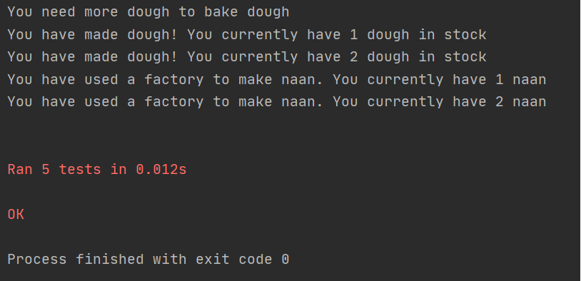

# TDD Bread Factory!

## Timings

60-90 Minutes

## Summary

TDD bread factory is the latest bread brand in Py Land. It always produces the best bread because it has the best testing strategy!

What they do is before they make any new bread, they make a test to make sure the end output is correct. Then they adjust the recipe until it's just right!

You are going to do the same with bread! This is called Test Driven Development.

## Tasks

This exercise is going to bring together lots of concepts.

### Learning Outcomes
Learning outcomes include:
- git
- github
- functions
- TDD
- Separation of concerns - this is important do not ignore!
- DRY code
- DOD


## Installing and running
To run the naan factory do the following:

``` python
import naan factory
run factory()
```


### TDD - test driven development

1. write the test
2. run it, and read the error
3. code and make it pass the test

this helps with:
- Over engineering
- Maintainable code
- Reduce technical debt
- Goes well with agile and working code
- errors can be your guide in complex systems

How it works is that we write unit tests.

##### Unit Tests

Test single pieces of code. Like a function.

**base of a test**
Usually has 3 phases.
- setup phase (know variables)
- calling of the function / piece of code with know variables
- asserting for expect output


### User stories for Naan Factory

```
#1
As a user, I can use the make dough with 'water' and 'flour' to make 'dough'.

#2
As a user, I can use the bake dough with dough to get naan.

#3
As a user, I can user the run factory with water and flour and get naan.

```

## Acceptance Criteria

* you have written tests
* test pass
* you have written more test to make sure everything works as indented
* all user stories are satisfied
* code does not break
* code has exit condition
* DOD if followed

## Solution
#### Testing
- First the tests are created in a file beginning with test_ in this example ```test_main```
- Unittest is imported to allow us to check for errors
- Methods are defined to test the bake_dough, make_dough and run_factory methods with expected outcomes
- The test is run using ```pytest -v``` inside the terminal with failures expected on all tests.
``` python
from naan_factory import Factory
import unittest


class naan_factory_test(unittest.TestCase):
    factory = Factory()

    # expected to return "no naan" as there isn't any dough when the test runs
    def test_bake_dough(self):
        self.assertEqual(self.factory.bake_dough(), "no naan")

    # expected to return "dough" as arguments "flour" and "water" are passed
    def test_make_dough(self):
        self.assertEqual(self.factory.make_dough("flour", "water"), "dough")

    # testing to see if order of arguments matters
    def test_make_dough_two(self):
        self.assertEqual(self.factory.make_dough("water", "flour"), "dough")

    # expected to return "dough" as arguments "flour" and "water" are passed
    def test_run_factory(self):
        self.assertEqual(self.factory.run_factory("flour", "water"), "naan")

    # testing to see if order of arguments matters
    def test_run_factory_two(self):
        self.assertEqual(self.factory.run_factory("flour", "water"), "naan")
```
#### Main File
- This is the file where all the code is run from. As a result, we must import the Factory class from naan_factory file
- An instance of the class must then be created
- the factory() function is then called using the class instance
``` python
from naan_factory import Factory

# creating an instance of Factory class
naan_factory = Factory()

# calling factory function from naan_factory
naan_factory.factory()
```

#### naan_factory
- Class is defined with attributes processes, dough and naan
- dough and naan are set to 0 by default as they need to be made first
``` python
class Factory:
    def __init__(self):
        self.processes = ['Make Dough', 'Bake Dough', 'Run Factory', 'Display dough', 'Display naan']
        self.dough = 0
        self.naan = 0
```
- make_dough, bake_dough and run_factory methods are added
``` python
    def make_dough(self, arg1, arg2):
        # if "water" and "flour" are entered for arg1 and arg2 or arg2 and arg1 respectively a dough is added
        if (arg1 == "water" and arg2 == "flour") or (arg1 == "flour" and arg2 == "water"):
            self.dough += 1
            print(f"You have made dough! You currently have {self.dough} dough in stock")
            return "dough"

        else:
            print("You need flower and water to make dough")
            return "no dough"
    
    # this function checks if there is any dough. If there is dough, naan is made and dough is reduced by 1
    def bake_dough(self):
        if self.dough >= 1:
            self.naan += 1
            self.dough -= 1
            print(f"You have made {self.naan} naan")
            return "naan"

        elif self.dough == 0:
            print("You need more dough to bake dough")
            return "no naan"

    def run_factory(self, arg1, arg2):
        # if "water" and "flour" are entered for arg1 and arg2 or arg2 and arg1 respectively a naan is made
        if (arg1 == "water" and arg2 == "flour") or (arg1 == "flour" and arg2 == "water"):
            self.naan += 1
            print(f"You have used a factory to make naan. You currently have {self.naan} naan")
            return "naan"
        else:
            return "no naan"

```
- The factory method is defined which asks the user which method they wish to use then calls the relevant function
- If exit is typed the loop breaks
``` python
 def factory(self):
        # infinite loop created to keep promoting user
        while True:
            # prompts user to select a process from the list
            process = input(f" \n Which process would you like to use? \n{self.processes} \n Type exit to leave.\n\n ")
            if process.lower() == "make dough":
                arg1 = input("What is your first ingredient?    ")
                arg2 = input("What is your second ingredient?    ")
                self.make_dough(arg1, arg2)

            if process.lower() == "bake dough":
                self.bake_dough()

            if process.lower() == "run factory":
                arg1 = input("What is your first ingredient?    ")
                arg2 = input("What is your second ingredient?    ")
                self.run_factory(arg1, arg2)

            if process.lower() == "display dough":
                print(self.dough)

            if process.lower() == "display naan":
                print(self.naan)

            elif process.lower() == "exit":
                break
```
- Together:
``` python
class Factory:
    def __init__(self):
        self.processes = ['Make Dough', 'Bake Dough', 'Run Factory', 'Display dough', 'Display naan']
        self.dough = 0
        self.naan = 0

    def factory(self):
        # infinite loop created to keep promoting user
        while True:
            # prompts user to select a process from the list
            process = input(f" \n Which process would you like to use? \n{self.processes} \n Type exit to leave.\n\n ")
            if process.lower() == "make dough":
                arg1 = input("What is your first ingredient?    ")
                arg2 = input("What is your second ingredient?    ")
                self.make_dough(arg1, arg2)

            if process.lower() == "bake dough":
                self.bake_dough()

            if process.lower() == "run factory":
                arg1 = input("What is your first ingredient?    ")
                arg2 = input("What is your second ingredient?    ")
                self.run_factory(arg1, arg2)

            if process.lower() == "display dough":
                print(self.dough)

            if process.lower() == "display naan":
                print(self.naan)

            elif process.lower() == "exit":
                break

    def make_dough(self, arg1, arg2):
        # if "water" and "flour" are entered for arg1 and arg2 or arg2 and arg1 respectively a dough is added
        if (arg1 == "water" and arg2 == "flour") or (arg1 == "flour" and arg2 == "water"):
            self.dough += 1
            print(f"You have made dough! You currently have {self.dough} dough in stock")
            return "dough"

        else:
            print("You need flower and water to make dough")
            return "no dough"

    def bake_dough(self):
        if self.dough >= 1:
            self.naan += 1
            self.dough -= 1
            print(f"You have made {self.naan} naan")
            return "naan"

        elif self.dough == 0:
            print("You need more dough to bake dough")
            return "no naan"

    def run_factory(self, arg1, arg2):
        # if "water" and "flour" are entered for arg1 and arg2 or arg2 and arg1 respectively a naan is made
        if (arg1 == "water" and arg2 == "flour") or (arg1 == "flour" and arg2 == "water"):
            self.naan += 1
            print(f"You have used a factory to make naan. You currently have {self.naan} naan")
            return "naan"
        else:
            return "no naan"
```

#### Results

- as shown in the image above, all tests passed successfully indicating that the code is functioning